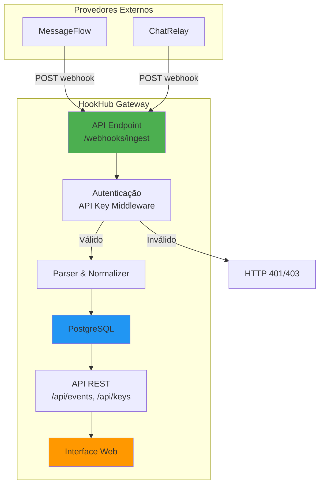
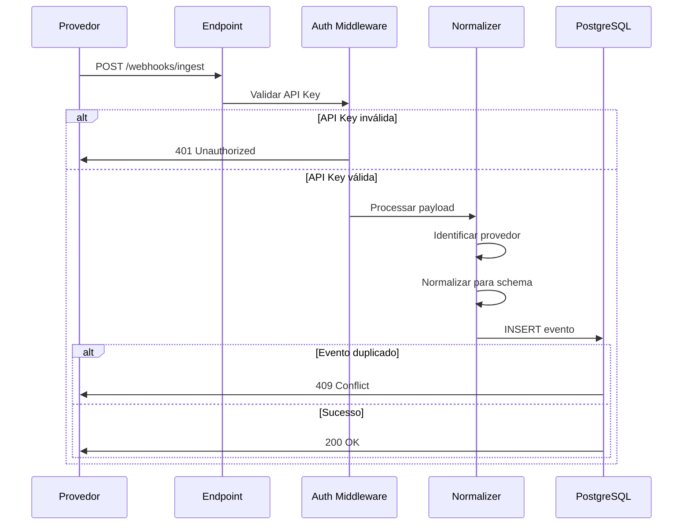

# HookHub - Plano de Implementação Detalhado

## Visão Geral do projeto

Construir um **serviço gateway de webhooks** que:
- Recebe eventos de múltiplos provedores externos (MessageFlow e ChatRelay)
- Normaliza payloads diferentes em um schema unificado
- Persiste eventos de forma confiável no PostgreSQL
- Fornece API REST para consulta de eventos
- Oferece interface web para gerenciamento de eventos e API keys
- Implementa autenticação via API keys
- Garante idempotência e resposta rápida (< 200ms)

---

## Requisitos Extraídos do projeto

### 1. Ingestão de Webhooks
- ✅ Endpoint HTTP POST para receber payloads
- ✅ Suportar 2 formatos diferentes (MessageFlow e ChatRelay)
- ✅ Normalizar para schema único na tabela `events`
- ✅ Responder em até 200ms
- ✅ Persistir no PostgreSQL
- ✅ Garantir idempotência (duplicatas não criam registros duplicados)

### 2. Autenticação de Provedores
- ✅ API keys vinculadas a provedores específicos
- ✅ Rejeitar requisições sem API key válida
- ✅ Retornar códigos HTTP apropriados (401/403)

### 3. Interface de Gerenciamento
**Histórico de Eventos:**
- ✅ Consultar eventos por provedor, tipo e/ou intervalo de tempo
- ✅ Exibir resultados em lista paginada

**Gerenciamento de API Keys:**
- ✅ Criar novas chaves para um provedor
- ✅ Listar chaves existentes (mascarar valor após criação)
- ✅ Revogar chaves

### 4. Restrições Técnicas
- ✅ **Banco de dados:** PostgreSQL
- ✅ **Framework:** Livre escolha (Elixir/Phoenix é diferencial)
- ✅ **Execução:** Docker Compose

---

## Arquitetura Proposta



---

## Schema do Banco de Dados

### Tabela: `providers`
Armazena informação sobre os provedores de webhook.

```sql
CREATE TABLE providers (
    id UUID PRIMARY KEY DEFAULT gen_random_uuid(),
    name VARCHAR(100) NOT NULL UNIQUE,
    description TEXT,
    created_at TIMESTAMP NOT NULL DEFAULT NOW(),
    updated_at TIMESTAMP NOT NULL DEFAULT NOW()
);
```

### Tabela: `api_keys`
Gerencia as chaves de API para autenticação.

```sql
CREATE TABLE api_keys (
    id UUID PRIMARY KEY DEFAULT gen_random_uuid(),
    provider_id UUID NOT NULL REFERENCES providers(id) ON DELETE CASCADE,
    key_hash VARCHAR(255) NOT NULL UNIQUE,
    key_prefix VARCHAR(20) NOT NULL,
    name VARCHAR(100),
    is_active BOOLEAN NOT NULL DEFAULT true,
    expires_at TIMESTAMP,
    created_at TIMESTAMP NOT NULL DEFAULT NOW(),
    revoked_at TIMESTAMP
);

CREATE INDEX idx_api_keys_provider ON api_keys(provider_id);
CREATE INDEX idx_api_keys_hash ON api_keys(key_hash);
```

### Tabela: `events` (Schema Normalizado)
Armazena todos os eventos de webhook em formato unificado.

```sql
CREATE TABLE events (
    id UUID PRIMARY KEY DEFAULT gen_random_uuid(),
    provider_id UUID NOT NULL REFERENCES providers(id),
    external_event_id VARCHAR(255) NOT NULL,
    event_type VARCHAR(100) NOT NULL,
    timestamp TIMESTAMP NOT NULL,
    
    -- Dados do remetente
    sender_id VARCHAR(255),
    sender_name VARCHAR(255),
    
    -- Dados do destinatário
    recipient_id VARCHAR(255),
    recipient_name VARCHAR(255),
    
    -- Conteúdo da mensagem
    message_type VARCHAR(50),
    message_body TEXT,
    
    -- Metadados adicionais
    platform VARCHAR(50),
    raw_payload JSONB NOT NULL,
    
    created_at TIMESTAMP NOT NULL DEFAULT NOW(),
    
    CONSTRAINT unique_provider_event UNIQUE(provider_id, external_event_id)
);

CREATE INDEX idx_events_provider ON events(provider_id);
CREATE INDEX idx_events_type ON events(event_type);
CREATE INDEX idx_events_timestamp ON events(timestamp);
CREATE INDEX idx_events_created ON events(created_at);
```

---

## Mapeamento de Payloads

### Provedor A: MessageFlow → Schema Normalizado

**Payload Original:**
```json
{
  "event_id": "mf_evt_8a7b6c5d4e3f2a1b",
  "event_type": "message.inbound",
  "timestamp": "2025-01-15T14:32:07Z",
  "data": {
    "message_id": "mf_msg_1a2b3c4d5e6f",
    "sender": {
      "id": "usr_mf_7k9m2p4q8r1t",
      "name": "João Silva"
    },
    "recipient": {
      "id": "acc_mf_3x5z7w9y1v0u"
    },
    "content": {
      "type": "text",
      "body": "Olá, gostaria de agendar uma consulta."
    }
  }
}
```

**Mapeamento:**
- `external_event_id` ← `event_id`
- `event_type` ← `event_type`
- `timestamp` ← `timestamp`
- `sender_id` ← `data.sender.id`
- `sender_name` ← `data.sender.name`
- `recipient_id` ← `data.recipient.id`
- `recipient_name` ← `null`
- `message_type` ← `data.content.type`
- `message_body` ← `data.content.body`
- `platform` ← `"MessageFlow"`
- `raw_payload` ← payload completo

### Provedor B: ChatRelay → Schema Normalizado

**Payload Original:**
```json
{
  "id": "cr-20250115-143207-abc123",
  "type": "INCOMING_MESSAGE",
  "created_at": 1736951527,
  "payload": {
    "msg_ref": "cr-msg-xyz789",
    "platform": "WHATSAPP",
    "from": "+5511999887766",
    "from_name": "João Silva",
    "to": "+5511888776655",
    "message": {
      "format": "TEXT",
      "text": "Olá, gostaria de agendar uma consulta."
    }
  }
}
```

**Mapeamento:**
- `external_event_id` ← `id`
- `event_type` ← `type` (normalizar para lowercase com ponto)
- `timestamp` ← converter `created_at` (Unix timestamp → ISO)
- `sender_id` ← `payload.from`
- `sender_name` ← `payload.from_name`
- `recipient_id` ← `payload.to`
- `recipient_name` ← `null`
- `message_type` ← `payload.message.format` (lowercase)
- `message_body` ← `payload.message.text`
- `platform` ← `payload.platform`
- `raw_payload` ← payload completo

---

## Endpoints da API

### 1. Ingestão de Webhooks

```
POST /webhooks/ingest
Content-Type: application/json
X-API-Key: <api_key>

Body: <payload do provedor>

Responses:
- 200 OK: Evento processado com sucesso
- 400 Bad Request: Payload inválido
- 401 Unauthorized: API key ausente ou inválida
- 403 Forbidden: API key expirada ou revogada
- 409 Conflict: Evento duplicado (idempotência)
```

### 2. Consulta de Eventos

```
GET /api/events?provider=<id>&event_type=<type>&start_date=<iso>&end_date=<iso>&page=1&limit=20
Authorization: Bearer <token>

Response:
{
  "data": [...],
  "pagination": {
    "page": 1,
    "limit": 20,
    "total": 150,
    "total_pages": 8
  }
}
```

### 3. Gerenciamento de API Keys

```
POST /api/keys
Content-Type: application/json

{
  "provider_id": "<uuid>",
  "name": "Production Key"
}

Response:
{
  "id": "<uuid>",
  "key": "hh_live_abc123...",  // Mostrado apenas uma vez
  "provider_id": "<uuid>",
  "created_at": "2025-01-15T14:32:07Z"
}
```

```
GET /api/keys?provider_id=<uuid>

Response:
{
  "data": [
    {
      "id": "<uuid>",
      "key_prefix": "hh_live_abc",
      "name": "Production Key",
      "is_active": true,
      "created_at": "2025-01-15T14:32:07Z"
    }
  ]
}
```

```
DELETE /api/keys/:id

Response: 204 No Content
```

---

## Estrutura do Projeto (Elixir/Phoenix)

```
hookhub/
├── config/
│   ├── config.exs
│   ├── dev.exs
│   ├── prod.exs
│   └── test.exs
├── lib/
│   ├── hookhub/
│   │   ├── providers/
│   │   │   ├── provider.ex
│   │   │   └── api_key.ex
│   │   ├── events/
│   │   │   ├── event.ex
│   │   │   ├── normalizer.ex
│   │   │   └── ingestion.ex
│   │   ├── repo.ex
│   │   └── application.ex
│   └── hookhub_web/
│       ├── controllers/
│       │   ├── webhook_controller.ex
│       │   ├── event_controller.ex
│       │   └── api_key_controller.ex
│       ├── views/
│       ├── templates/
│       ├── plugs/
│       │   └── api_key_auth.ex
│       ├── router.ex
│       └── endpoint.ex
├── priv/
│   ├── repo/
│   │   └── migrations/
│   └── static/
├── test/
├── docker-compose.yml
├── Dockerfile
├── mix.exs
└── README.md
```

---

## Fluxo de Ingestão de Webhook



---

## Implementação de Idempotência

A idempotência é garantida através da constraint `UNIQUE(provider_id, external_event_id)` no banco de dados.

**Estratégia:**
1. Extrair `external_event_id` do payload do provedor
2. Tentar inserir evento no banco
3. Se violação de constraint única → retornar 200 OK (evento já existe)
4. Se sucesso → retornar 200 OK (evento criado)

**Código exemplo (Elixir):**
```elixir
case Repo.insert(changeset) do
  {:ok, event} -> 
    {:ok, event}
  {:error, %Ecto.Changeset{errors: [external_event_id: {"has already been taken", _}]}} ->
    # Idempotência: evento já existe
    {:ok, :duplicate}
  {:error, changeset} ->
    {:error, changeset}
end
```

---

## Interface Web - Wireframes

### Página: Histórico de Eventos

```
┌─────────────────────────────────────────────────────────┐
│ HookHub - Histórico de Eventos                          │
├─────────────────────────────────────────────────────────┤
│                                                          │
│ Filtros:                                                 │
│ [Provedor ▼] [Tipo de Evento ▼] [Data Início] [Data Fim]│
│ [Buscar]                                                 │
│                                                          │
│ ┌────────────────────────────────────────────────────┐  │
│ │ ID: abc-123 | MessageFlow | message.inbound       │  │
│ │ 2025-01-15 14:32:07                                │  │
│ │ João Silva → acc_mf_3x5z7w9y1v0u                   │  │
│ │ "Olá, gostaria de agendar uma consulta."          │  │
│ │ [Ver Detalhes]                                     │  │
│ └────────────────────────────────────────────────────┘  │
│                                                          │
│ ┌────────────────────────────────────────────────────┐  │
│ │ ID: xyz-789 | ChatRelay | INCOMING_MESSAGE        │  │
│ │ 2025-01-15 14:32:27                                │  │
│ │ +5511999887766 → +5511888776655                    │  │
│ │ "Olá, gostaria de agendar uma consulta."          │  │
│ │ [Ver Detalhes]                                     │  │
│ └────────────────────────────────────────────────────┘  │
│                                                          │
│ [← Anterior] Página 1 de 8 [Próximo →]                  │
└─────────────────────────────────────────────────────────┘
```

### Página: Gerenciamento de API Keys

```
┌─────────────────────────────────────────────────────────┐
│ HookHub - API Keys                                       │
├─────────────────────────────────────────────────────────┤
│                                                          │
│ Criar Nova Chave:                                        │
│ [Provedor ▼] [Nome da Chave]                            │
│ [Criar Chave]                                            │
│                                                          │
│ Chaves Existentes:                                       │
│                                                          │
│ ┌────────────────────────────────────────────────────┐  │
│ │ MessageFlow - Production Key                       │  │
│ │ hh_live_abc*** (criada em 2025-01-10)              │  │
│ │ Status: Ativa                                      │  │
│ │ [Revogar]                                          │  │
│ └────────────────────────────────────────────────────┘  │
│                                                          │
│ ┌────────────────────────────────────────────────────┐  │
│ │ ChatRelay - Test Key                               │  │
│ │ hh_test_xyz*** (criada em 2025-01-12)              │  │
│ │ Status: Ativa                                      │  │
│ │ [Revogar]                                          │  │
│ └────────────────────────────────────────────────────┘  │
└─────────────────────────────────────────────────────────┘
```

---

## Docker Compose

```yaml
version: '3.8'

services:
  db:
    image: postgres:15-alpine
    environment:
      POSTGRES_USER: hookhub
      POSTGRES_PASSWORD: hookhub_dev
      POSTGRES_DB: hookhub_dev
    ports:
      - "5432:5432"
    volumes:
      - postgres_data:/var/lib/postgresql/data
    healthcheck:
      test: ["CMD-SHELL", "pg_isready -U hookhub"]
      interval: 10s
      timeout: 5s
      retries: 5

  app:
    build: .
    depends_on:
      db:
        condition: service_healthy
    environment:
      DATABASE_URL: postgres://hookhub:hookhub_dev@db:5432/hookhub_dev
      SECRET_KEY_BASE: <gerar_chave_secreta>
      PORT: 4000
    ports:
      - "4000:4000"
    volumes:
      - .:/app
    command: mix phx.server

volumes:
  postgres_data:
```

---

## Checklist de Verificação Final

Antes de considerar o projeto completo, verificar:

- [ ] `docker compose up` inicia todos os serviços sem erros
- [ ] Banco de dados é criado com todas as tabelas
- [ ] Endpoint de ingestão aceita payloads MessageFlow
- [ ] Endpoint de ingestão aceita payloads ChatRelay
- [ ] Eventos são normalizados corretamente
- [ ] Enviar mesmo evento 2x não cria duplicata
- [ ] API key inválida retorna 401
- [ ] API de consulta retorna eventos filtrados
- [ ] Paginação funciona corretamente
- [ ] Interface web carrega sem erros
- [ ] Possível criar nova API key pela interface
- [ ] Possível listar API keys pela interface
- [ ] Possível revogar API key pela interface
- [ ] Filtros de eventos funcionam na interface
- [ ] README contém instruções completas

---

## Próximos Passos

1. **Escolher framework** (Elixir/Phoenix recomendado)
2. **Criar estrutura inicial** do projeto
3. **Configurar Docker Compose**
4. **Implementar migrations** do banco de dados
5. **Desenvolver endpoint de ingestão**
6. **Implementar autenticação**
7. **Criar APIs de consulta**
8. **Desenvolver interface web**
9. **Testar e validar**
10. **Documentar**

---

## Estimativa de Tempo

- Setup inicial + Docker: **2-3 horas**
- Banco de dados + Migrations: **1-2 horas**
- API de ingestão + Normalização: **4-6 horas**
- Autenticação: **2-3 horas**
- APIs de consulta: **2-3 horas**
- Interface web: **4-6 horas**
- Testes e ajustes: **2-4 horas**
- Documentação: **1-2 horas**

**Total estimado: 18-29 horas** (2-4 dias de trabalho focado)
